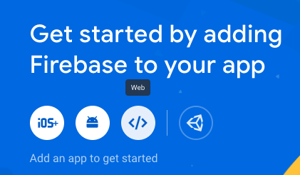
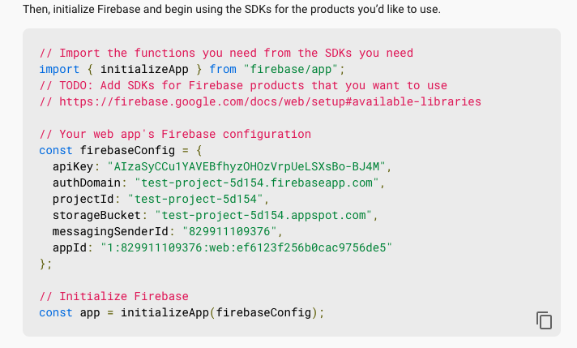
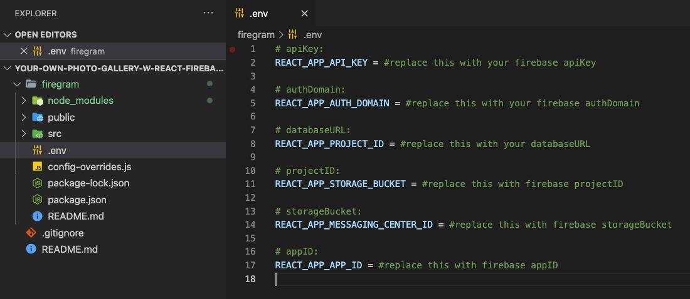
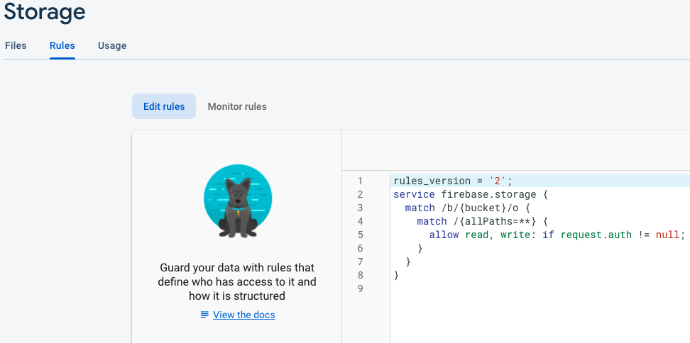
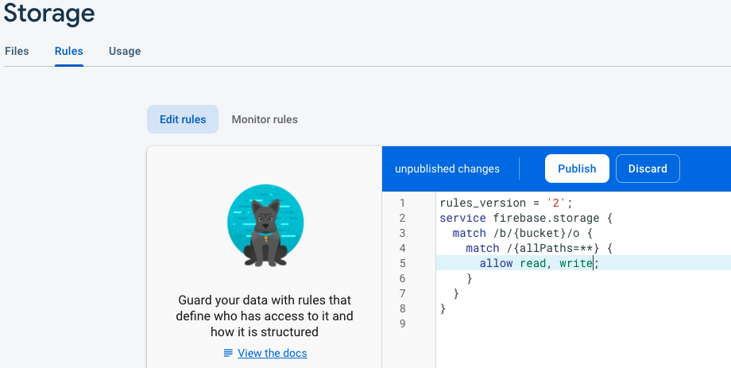

# Setting up Firebase

Go to [Firebase homepage](https://firebase.google.com/) and create a new free account (if you don't already have). Follow the steps below:

1.  Go to your account's console by clicking **Go to console** on the upper right corner.
2.  Click on **+ Add project** and name it whatever you like. Follow the steps (un-click Google analytics) and the project is created!  
    
3.  Now you are redirected in the project's main page. Click the **</>** icon (tooltip: Web) to register a new front-end app. Name it **firegram** and hit **Register app**  
    
4.  A **firebaseConfig** object will be provided right after registration. **Copy** each value individually and paste it in the **.env** file inside this project respectively. After you are finished, click **Continue to Console**  
     &nbsp; 
5.  On the sidebar, click on **Firestore Database** and **Create database** . On the popup window, select **Start in test mode** and hit `Next` -> `Enable`. Database is set!
6.  Finally, on the sidebar again, click on **Storage**. Select **Rules** tab and **change** `allow read, write: if request.auth != null;` **to** `allow read, write;`. Hit the **Publish** button. The Database is all set!!  
     &nbsp; 
    > Note: Now everyone can read-write in your created Database. You have to make auth rules if you want protect your data because this project is not meant for production!!

# Setting up the app

After setting up Firebase, the next step is to download the project's dependencies.
Open a terminal in the project directory and run: <b>`npm install` </b>.

# Run the app

Open a terminal in the project directory and run: <b>`npm start` </b>.
The app will run at localhost:3000.
